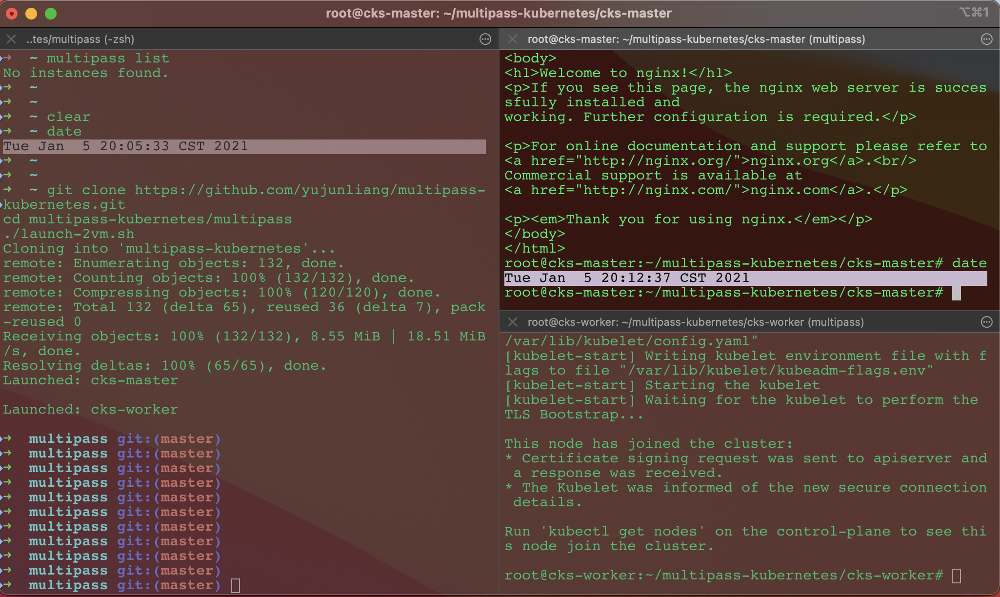

These are the links to install and create kubernetes cluster,

0. [multipass](https://multipass.run/)
1. [Container runtimes](https://kubernetes.io/docs/setup/production-environment/container-runtimes/)
2. [Installing kubeadm](https://kubernetes.io/docs/setup/production-environment/tools/kubeadm/install-kubeadm/)
3. [Creating a cluster with kubeadm](https://kubernetes.io/docs/setup/production-environment/tools/kubeadm/create-cluster-kubeadm/)

Step 1. Create two Ubuntu VMs

```
$ cd multipass
$ ./launch-2vm.sh
```

Step 2. From second terminal window

```
$ cd multipass
$ ./ssh-to-cks-master.sh
```

when in cks-master,execute the following commands

```
$ sudo -i
# git clone https://github.com/yujunliang/multipass-kubernetes.git
# cd multipass-kubernetes/cks-master
# ./containerd.sh
# ./docker.sh
# ./install.sh
```
copy the output like this,

```
kubeadm join 192.168.64.3:6443 --token al0kvi.x60mi1xj4zesqnq3     --discovery-token-ca-cert-hash sha256:f4ff0c7684bbac599a8208b94bb28e451023662ab51bc1ce16f60a855a85e2a5
```

Step 3.From third terminal window

```
$ cd multipass
$ ./ssh-to-cks-worker.sh
```

when in cks-worker,execute the following commands

```
$ sudo -i
# git clone https://github.com/yujunliang/multipass-kubernetes.git
# cd multipass-kubernetes/cks-worker
# ./containerd.sh
# ./docker.sh
# ./install.sh
```

then run what you copied from Step 2, something like this,

```
$ kubeadm join 192.168.64.3:6443 --token al0kvi.x60mi1xj4zesqnq3     --discovery-token-ca-cert-hash sha256:f4ff0c7684bbac599a8208b94bb28e451023662ab51bc1ce16f60a855a85e2a5
```

Step 4. On second window, cks-master

```
# kubectl get nodes
NAME         STATUS   ROLES    AGE   VERSION
cks-master   Ready    master   34h   v1.19.0
cks-worker   Ready    <none>   34h   v1.19.0

# kubectl run nginx --image=nginx
pod/nginx created

# kubectl get pod
NAME    READY   STATUS    RESTARTS   AGE
nginx   1/1     Running   0          19s
```


Terminal [iTerm2](https://iterm2.com/) window layout,

```
+------------------+-----------------------+
| macOS            | cks-master            |
|                  +-----------------------+
|                  | cks-worker            |
+------------------+-----------------------+
```

Screenshot,



